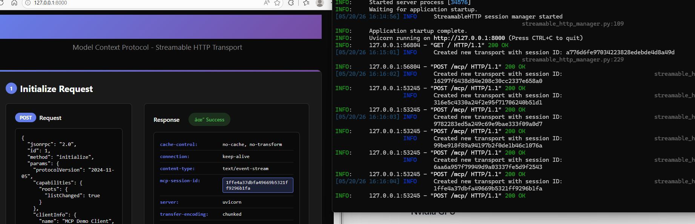

## Setup

Install dependencies using uv:

```bash
uv sync
```

## Running the Project

Run the MCP server:

```bash
uv run main.py
```
## Demo


*MCP Chat running with llama3.2 via Ollama on Windows*
